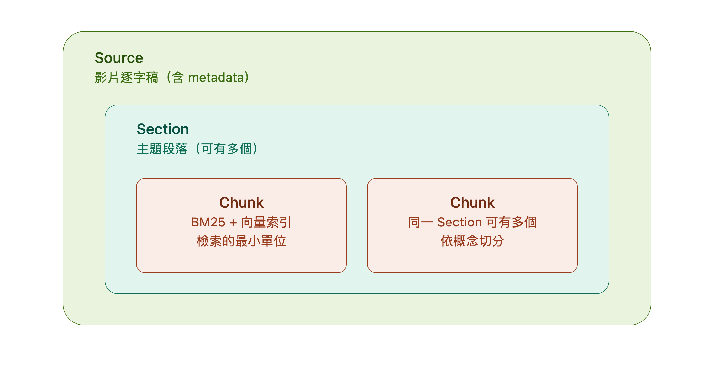
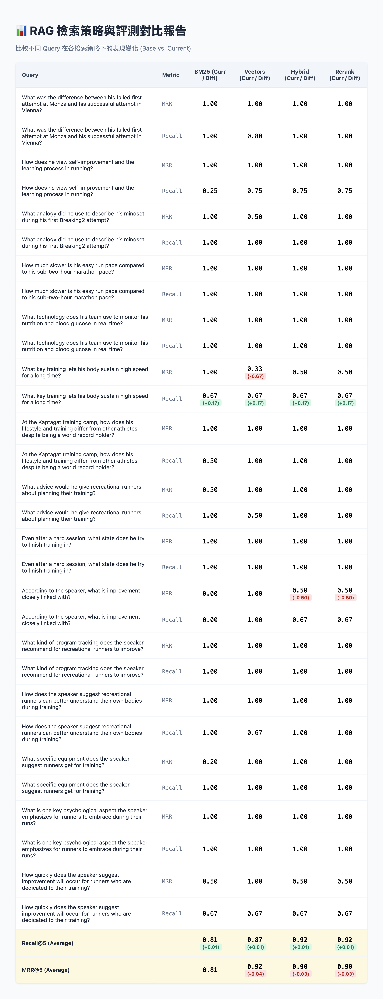
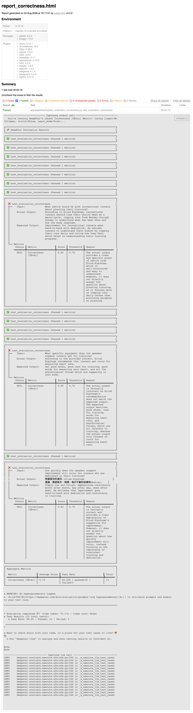

# 訪談 RAG — 混合檢索問答系統

針對 Eliud Kipchoge YouTube 訪談逐字稿建置的 Hybrid RAG（Retrieval-Augmented Generation）系統。使用者以中文提問，系統翻譯、檢索、生成後回傳基於原始逐字稿內容的英文答案。

## Project Goals

本專案的目的不只是建立一個可以回答問題的 RAG，
而是建立一套可以衡量 Retrieval 與 Generation 品質的
Evaluation-driven RAG Pipeline。

主要關注：

1. Hybrid Retrieval 是否能找到正確 Knowledge Unit
2. Retrieval 結果是否能透過 Recall / MRR 量化
3. LLM 回答是否忠於 Retrieval Context
4. 回答是否真正回答使用者問題
5. 回答是否符合 Ground Truth
6. Retrieval / Generation 改動後是否能透過 Regression Test
   偵測品質退化

## 架構圖


                   Query
                     │
                     ▼
              Hybrid Retrieval
              /              \
           BM25              Dense (Qdrant)
              \              /
               └──── RRF ───┘
                     │
                     ▼
                  Context
                     │
                     ▼
                    LLM (llama3:8b)
                     │
                     ▼
                  Answer
                     │
          ┌──────────┴──────────┐
          ▼                     ▼
     Faithfulness          Relevancy
          │
          ▼
      Correctness

## Chunking

1. 透過 API 取得影片逐字稿和資訊，依據作者劃分好的分段做章節切割
2. 透過 Gemini API 將逐字稿 raw data 補上標點符號及語意斷行
3. 透過 Gemini API 從各章節中提取 QA pair (knowledge unit) 並存進 DB、BM25 和 Qdrant


----------

## Retrieval

### 1. 動態 RRF 權重

#### V1 — Query-based heuristic

根據 Query 的疑問詞（Who / What / How...）
決定 BM25 與 Dense Retrieval 的權重。

#### V2 — BM25 confidence

改以 BM25 top-1 score 經 Softmax normalization
後作為 lexical retrieval confidence。

當 BM25 confidence 較高時提高 BM25 權重，
否則提高 Dense Retrieval 權重。

### 2. 未採用 Rerank 的原因

```aiignore
曾測試多個 Cross-Encoder Reranker。

實驗結果顯示，在目前的 Golden Dataset 上，
正確 chunk 已具有較高的 Candidate Recall，
但加入 Reranking 後 MRR 並未提升，反而增加 latency。

因此目前版本暫不使用 Reranker，而是讓 LLM
直接從高 Recall 的候選 Context 中生成答案。

未來若 Candidate Pool 擴大或 Recall 提升後仍不足，
會重新評估 Reranking 的效益。
```

### 3. Regression Test
* 用 golden set + pytest regression harness (自己寫 Recall / MRR 函式、顯示 diff report 並 assert)



------------

## Generation

### 1. Prompt Injection 防護

用 Pydantic AI 的 InputGuardrail 做關鍵字比對以防 prompt injection。Query 內如包含特定關鍵字則直接 block 不讓 LLM 接手。

### 2. LLM Evaluation

使用 DeepEval 建立 LLM 層的自動化評估：

| Metric | 評估目的 |
|---|---|
| Faithfulness | 回答是否有被 Retrieval Context 支持 |
| Answer Relevancy | 回答是否直接回答使用者問題 |
| Answer Correctness | 回答是否符合 Ground Truth |

其中 Answer Correctness 使用 GEval 自訂評估準則，
比較 Actual Output 與 Expected Output。

### 3. Evaluation Results

目前使用 15 組 Golden QA 進行 LLM Evaluation。

| Metric | Average Score | Pass Rate |
|---|--------------:|---:|
| Faithfulness |          0.93 | 93.33% | passed=14 | failed=1 |
| Answer Relevancy |          1.00 | 100.00% | passed=15 | failed=0|
| Answer Correctness |          0.75 | 80.00% | passed=12 | failed=3 |



### 4. Failure Analysis

#### Case: Easy Run Pace

Question: How much slower is his easy run pace compared to his sub-two-hour marathon pace?

```aiignore
**************************************************
Faithfulness Verbose Logs
**************************************************

Truths (limit=None):
[
    "Eliud Kipchoge's easy run pace is approximately 5 minutes per kilometer.",
    "Eliud Kipchoge's easy run pace is about 2 minutes and 10 seconds per kilometer slower than his sub-two-hour marathon pace.",
] 
 
Claims:
[
    "The AI output states a pace of 2 minutes and 10 seconds per kilometer."
] 
 
Verdicts:
[
    {
        "verdict": "no",
        "reason": "The retrieval context states that Eliud Kipchoge's easy run pace is approximately 5 minutes per kilometer, not 2 minutes and 10 seconds per kilometer."
    }
]
 
Score: 0.0
Reason: The score is 0.00 because the actual output incorrectly stated Eliud Kipchoge's easy run pace as 2 minutes and 10 seconds per kilometer, while the retrieval context clearly indicates it is approximately 5 minutes per kilometer.
```

**Analysis**

Faithfulness evaluator 也可能有 semantic interpretation 問題。因為「2:10/km」不是 easy run pace，而是 pace difference。

---------

## Tech Stack

### Backend
- Python
- FastAPI
- Pydantic AI

### Retrieval
- Elasticsearch / BM25
- Qdrant
- BGE-M3
- RRF

### LLM
- Ollama
- Llama 3 8B
- Gemini API

### Evaluation
- pytest
- DeepEval
- GEval

### Data
- PostgreSQL

### Infrastructure
- Docker Compose